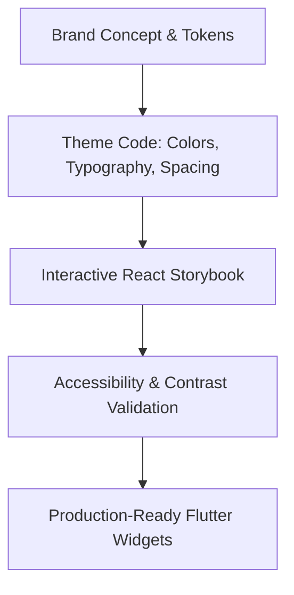

# Case Study: PandaHabits Interactive Design System & Flutter Storybook

An in-depth look at how we built a psychology-first habit tracker and its companion high-fidelity design system using an atomic, "Figma-less" workflow.

---

## 📌 Project Overview
* **Role:** Lead Product Designer & Frontend Developer (Pairing with AI)
* **Goal:** Design and document a scalable, accessible, and warm design system for a Flutter-based habit tracker, using React/Vite as the interactive storytelling platform.
* **Key Achievements:** 
  * 🚀 **Zero-Figma Workflow:** Atomic tokens coded directly into functional previews, eliminating design handoff friction.
  * ♿ **WCAG 2.1 AAA Standards:** Hardcoded contrast validations (minimum 7:1 ratio for AAA elements) and interactive touch physics rules.
  * 🧠 **Psychology-First UX:** Replaced typical spreadsheet-like counting metrics with mascot-guided, non-judgmental habits.

---

## 1. The Core Problem: Judgement-Free Tracking
Most health and nutrition applications feel like digital chore lists. They present users with clinical spreadsheets, rigid calorie counts, and subtle visual judgment for failing to hit arbitrary numbers. This often leads to tracking fatigue and self-sabotage.

**PandaHabits** was conceived to shift the focus from strict calculation to **sustainable habit-building psychology**:
* **The "Why" Over the "What":** Identifying emotional eating triggers and behavioral patterns is more valuable than logging single calories.
* **Warm Mascot Guidance:** The friendly Panda companion serves as an emotional buffer, softening the experience and reducing tracking guilt.
* **Positive Reinforcement:** Highlighting daily streaks and milestone roadmaps as micro-wins to release dopamine and encourage habit loops.

---

## 2. Design Philosophy & Brand Language
The visual tone is warm, clean, organic, and highly legible. It is driven by a carefully curated set of neutral surfaces, semantic colors, and premium typography.

### 🎨 Color Palette & Semantics

| Color Token | Hex | Concept / Usage | Psychology |
| :--- | :--- | :--- | :--- |
| **Panda Ink** | `#111827` | Primary text and headers | Grounding, high contrast |
| **Rice Paper** | `#F9FAFB` | App background | Warm, soft, non-sterile white |
| **Bamboo Green** | `#15803D` | Primary brand action and success CTAs | Growth, vitality, nourishment |
| **Matcha Glow** | `#DCFCE7` | Nutrition card and achievement backgrounds | Soft reassurance, fresh starts |
| **Mindful Teal** | `#0D9488` | Psychology insights and reflection actions | Stability, focus, mental clarity |
| **Calm Teal Tint** | `#CCFBF1` | Reflection card and lesson backgrounds | Restorative, meditative |
| **Panda Blush** | `#FB7185` | Restrictive pathways, streaks, highlights | Human touch, energy (used carefully) |
| **Sunshine** | `#FCD34D` | Streaks, wins, and star awards | Optimism, validation, reward |

---

## 3. The "Figma-less" Evolution
Instead of drawing static mockups in Figma, handing them over to engineering, and losing design intent during translation, we adopted a **code-first design workflow**:

1. **Tokens as Truth:** Define the base values (colors, spacing scales, and type scales) directly in code (`lib/theme/app_colors.dart`, `app_spacing.dart`).
2. **React Storybook Simulator:** Built an interactive web storybook (React + Vite + TypeScript) to preview and stress-test the components inside a virtual phone frame.
3. **Self-Correcting UI:** Programmed the storybook to analyze color pairings and throw warnings if contrast levels dropped below AAA standards.
4. **Immediate Widget Translation:** Flutter code templates were written side-by-side with visual components, allowing engineers to copy production-ready Dart widgets instantly.

---

## 4. Architectural Elements: Atomic Components
The design system scales systematically from basic tokens to full layouts using Atomic Design principles.

### 🧬 Atoms (Visual Primitives)
* **AppButton (`widgets/app_button.dart`):** Responsive button supporting primary, secondary, text, and danger variations. Designed with a custom physical layout height and `16px` rounded corners.
* **DateStripItem (`food_log_diary_screen.dart`):** A circular, stadium-shaped date picker cell that highlights the current day, displays calendar dates, and embeds micro-stars to denote "perfect habit days."
* **MacroBadge:** Color-coded circular indicators (Green for Protein, Yellow for Carbs, Red for Fats) that display nutritional info cleanly.
* **PandaAvatar (`widgets/panda_avatar.dart`):** The brand mascot capable of loading over 15 distinct emotive badges (`🤔`, `🎂`, `⚖️`, `🏃`) based on user context.

### 🧪 Molecules (Combined Blocks)
* **ContextCard:** Color-themed card surfaces featuring white glassmorphism icon backdrops and semantic borders (e.g. `Mindful Teal` accent lines over a `Calm Teal Tint` surface).
* **StreakCard:** Faded background icons overlaying solid metric trackers to highlight consistent habit streaks.
* **DailyProgress:** Combines a progress meter, caloric targets, and a micro-badge row into a single dashboard card.

### 🪐 Organisms (Interactive Experiences)
* **LogMealSheet:** A sliding bottom panel offering multi-modal input options (Barcode scan, Photo capture, or Search bar) to minimize interaction friction.
* **RecipeAssistant:** A responsive cooking simulator that scores recipe matches based on ingredients the user already has at home.

---

## 5. Accessibility (WCAG 2.1 AAA)
Accessibility wasn't treated as a compliance checklist; it was integrated into the initial layout logic.

### 👁️ Color Contrast & Color-Blindness
* **High Contrast Ratios:** Crucial text matches (e.g. `Panda Ink` on `Rice Paper` background) maintain contrast scores of **15.6:1**, exceeding the WCAG AAA requirement (7:1).
* **Non-Color Indicators:** Visual status is never indicated by color alone. Error messages are accompanied by alert icons (`⚠️`), and completed states feature checkmarks (`✅`).

### 📱 Touch Physics & Device Scaling
* **48dp Target Rules:** All interactive elements must measure at least `48x48` logical pixels. Icons with smaller visual footprints include invisible paddings to prevent mis-taps.
* **200% Text Scaling:** Containers use elastic layout paddings rather than fixed heights. If a user raises their system font scale to `2.0x`, text wraps cleanly without overlapping surrounding UI.
* **Reduced Motion Gating:** High-fidelity transition physics and parallax backgrounds auto-disable if the user activates system-level `prefers-reduced-motion` settings.

---

## 6. High-Fidelity App Walkthrough
Below is the core user journey simulated in our interactive storybook:

1. **Defining the Identity (Onboarding):** Minimalist inputs gather biological foundations (age, height, weight) without cognitive overload.
2. **Visualizing Reality (Projection):** The app charts a sustainable weight journey (`Bamboo Green`) against a restrictive crash diet (`Panda Blush`). This visually models the physiological rebound effect, encouraging users to play the long game.
3. **The Behavioral Profile (Psychology):** A 5-question questionnaire identifies habits (e.g., all-or-nothing thinking, stress-eating) to map a personalized psychological profile (e.g., *The Perfectionist Panda*).
4. **Daily Dashboard:** Centralizes meal tracking, water intake, daily reflections, and educational roadmap progress into a single unified space.

---

## 🛠️ Tech Stack & Implementation Details
* **Interactive Storybook Platform:** React 19, TypeScript, Vite, Tailwind CSS, Lucide React (for UI elements), Recharts (for SVG projections).
* **Target Mobile Application:** Flutter, Dart, Google Fonts (Manrope), Lottie Animations, and Flutter Animate.
* **AI Integration:** Gemini API (via Firebase AI Logic) utilized to generate recipe ideas, analyze uploaded food photos, and provide conversational habit coaching.
